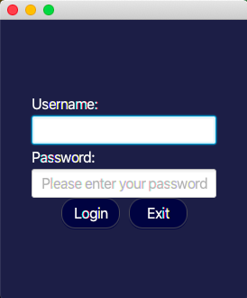
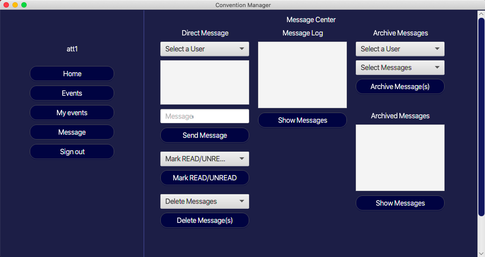
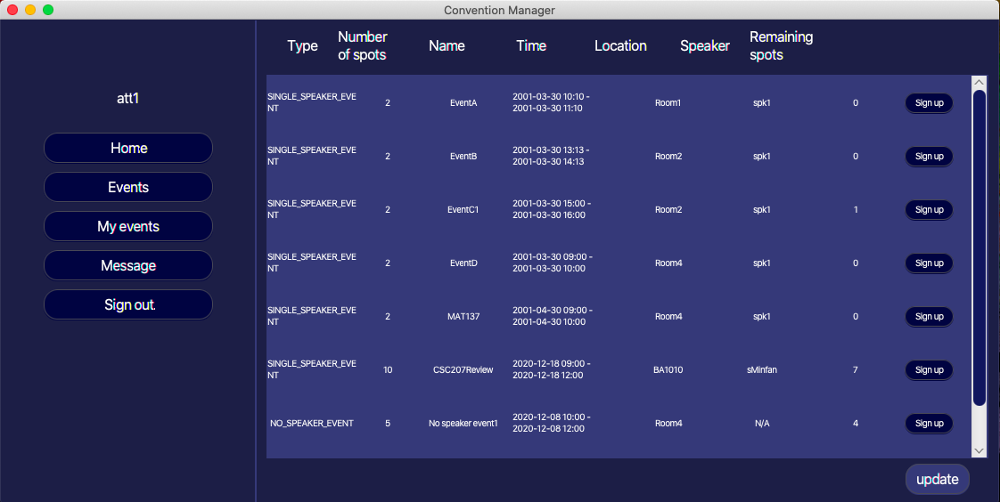

# Convention Manager
This project is designed for a program that allows people at a conference to log in as a different type of user to organize events, communicate with others, and sign up for events. It is integrated with a local database SQLite and GUI using JavaFx library. It also follows Clean Architecture and SOLID principles with the implementation of several design patterns such as Builder and Dependency Injection. A list of reasonings for design choices and design patterns can be founded [here](https://github.com/jangarong/CSC207H1-ConventionManager/raw/master/List%20of%20design%20choices.pdf).

   
   
  

**CSC207 Group_0070 Members:**
* Hassan Tariq
* Jan Garong
* Ruo Ning (Nancy) Qiu
* Seyon Kuganesan
* Shiyuan (Lucia) Luo
* Si (Leo) Wang
* Xiaoli (Lily) Yang
* Zhiying (Helen) He

### Instructions
1. Run `Main.java` to execute the program. To login, check the accounts detail in appendix section.
2. To exit the program, you need to click `Sign Out` for changes to be saved.

### Assumptions

**event_system**
* Event capacity cannot be 0.
* Event ID is unique.
* Event type: NO_SPEAKER_EVENT, SINGLE_SPEAKER_EVENT, and MULTI_SPEAKER_EVENT must match the number of speakers.

**room_system**
* If an event is going to be held at a room, then the event capacity should be less or equal to that room.
* Room capacity cannot be 0.
* Room ID is unique.
 
**user_system**
* Usernames and passwords are AlphaNumerical
* New users created by Organizer must be AlphaNumerical
* We disallow extra users not already in the database to be created

**message_system**
* Only recipient of a message can change the status of the message to UNREAD/READ/ARCHIVE manually
* Admin cannot message or being messaged
* Attendee cannot message Organizer
* Admin can delete any messages in the system; Other users can only delete messages that they have sent
* Show Message Log displays all messages, including archived ones related to the currently login user
* Archive Message Log displays archived messages related to the currently login user; they could be the sender or
  the receiver of the message

### Clean Architecture Layer
**Entities**
* Event
* Message
* User
* Room

**Use Cases**
* EventService
* MessageService
* UserService
* RoomService

**Controllers (Backend)**
* EventController
* MessageController
* RoomController
* UserController

**Controllers (GUI)**
* GUIAccountCreationController
* GUICancelEventController
* GUIEventController
* GUILoginController
* GUIMenuController
* GUIMessageController
* GUIScheduleController

**Controllers (Builders)**
* ControllerBuilder
* LoginBuilder
* MenuBuilder

**Gateways (Database)**
* DatabaseReadWriter
* EventDatabaseReadWriter
* MessageDatabaseReadWriter
* RoomDatabaseReadWriter
* UserDatabaseReadWriter

**Presenters**
* ComponentBuilder
* Component

### Appendix
**Accounts in the system**

| Name           | Password  | Type      |
|----------------|-----------|-----------|
| att1           | pass1     | ATTENDEE  |
| att2           | pass2     | ATTENDEE  |
| org1           | pass3     | ORGANIZER |
| spk1           | pass4     | SPEAKER   |
| att3           | pass5     | ATTENDEE  |
| att4           | pass6     | ATTENDEE  |
| att5           | pass7     | ATTENDEE  |
| sMinfan        | pass8     | SPEAKER   |
| dbtestUser     | 1234      | ATTENDEE  |
| dbTestUser2    | 12345test | ADMIN     |
| dbTestUser3    | 12345test | ADMIN     |
| dbtestspeaker  | pass      | SPEAKER   |
| dbtestattendee | pass      | ATTENDEE  |
| dbtestadmin    | pass      | ADMIN     |
